<div class="middle center">


<div class="title-slide-content" style="width: 100%; margin-top: 100px;">

# 基础工具与开发工具链拾遗

<hr/>

<div class="subtitle">The-Missing-Semester SYSU.ver</div>

<div class="avatar-container">
<a href="https://github.com/RunningKuma"></a>
<span class="avatar-name"> RunningKuma / 双面熊</span>
</div>

<div class="date">2026 年 3 月</div>

</div>
</div>

<!--s-->

## 本节内容

- Part.0 为什么还要学习基础工具链？
- Part.1 Shell, Terminal, 命令行工具与WSL
- Part.2 Vim、VS Code 以及远程开发
- Part.3 Git 和 GitHub
- Part.4 markdown,Typst,$\LaTeX \quad$学术与报告写作
- Part.5 从代码提示到 Vibe Coding
- Part.6 Agentic Coding 与 Coding Agent
- Part.7 拓展资料

<!--s-->

<div class="middle center">
<div style="width: 100%">

# Part.0 为什么还要学习基础工具链？

直接问 LLM 不爽吗？

</div>

</div>

<!--v-->
## 为什么你会选择计算机科学？

<div class="fragment">

- 觉得计算机很神奇/电子设备发烧友（左转 EE，请）/是 OI ✌️
- *我不到啊，报志愿的时候张xx老师说前景好工资高还火爆*

</div>

<div class="fragment">
<div style=" margin-top: 10px; margin-right: 10px;" markdown="1">

<a href="https://nju-projectn.github.io/ics-pa-gitbook/ics2025/" target="_blank">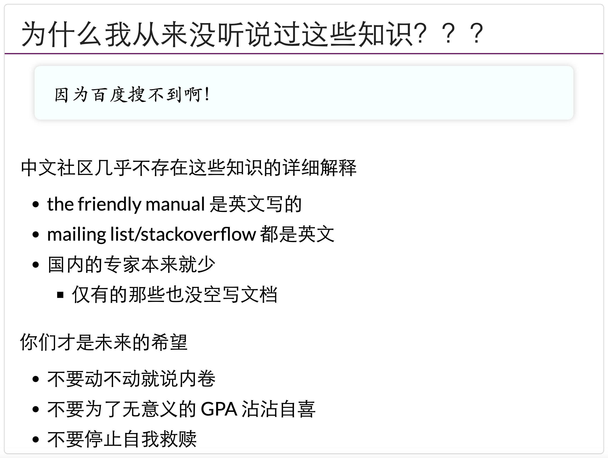</a>

每个人都向往大学的新生活,但迎接你的很有可能是当头一棒：

“我一度怀疑我是不是不适合学计算机，因为童年对于极客的所有想象，已经被我第一个学期的体验彻底粉碎了。”——[CS 自学指南](https://csdiy.wiki/)
<div class="fragment">

**我们希望不论是前一种还是后一种情况，都能让大家的大学生活好过一点**
</div>
</div>
<br/>
<!--v-->

## LLM 不是万能的

- LLM 的幻觉与不可靠性
  - [OpenClaw 删光 Meta 安全总监邮箱事件](https://zhuanlan.zhihu.com/p/2009613685228839023)
- 操作环境不允许你直接问 LLM
- 现阶段无法提供完整的上下文和复杂任务执行
- LLM 的效率与时间问题
  - *已深度思考 1h 38min*

<div style="display: flex; justify-content: center; gap: 15px; margin-top: 20px; align-items: center; width: 100%;">
  
  
  
</div>
<!--v-->

[一个真实发生的惨剧 (From Linux 201)](https://gist.github.com/Xuanwo/a8a85439cc6c391df7ddc0b1684a1c4e/)

<div style="display: flex; justify-content: space-between; align-items: flex-start; margin: 20px auto 10px auto; width: 96%;">
 <div style="width: 56%;">
  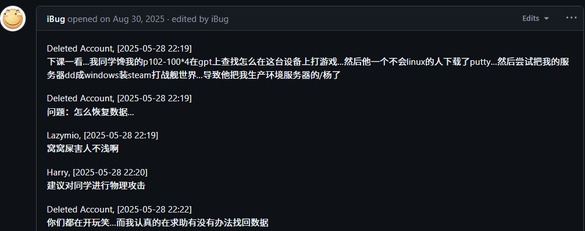
 </div>
 <div style="width: 48%;">
  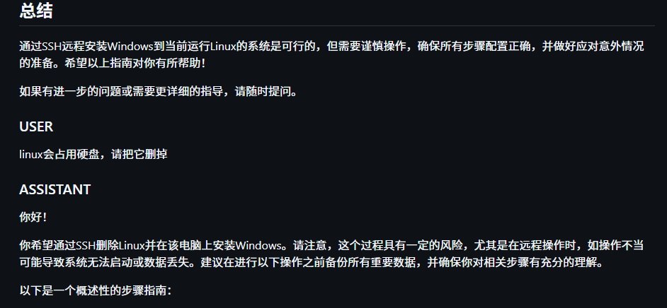
 </div>
</div>

<div class="fragment">
<div style="display: flex; justify-content: space-between; align-items: center; margin: 0 auto; width: 96%;">
 <div style="width: 56%;">
  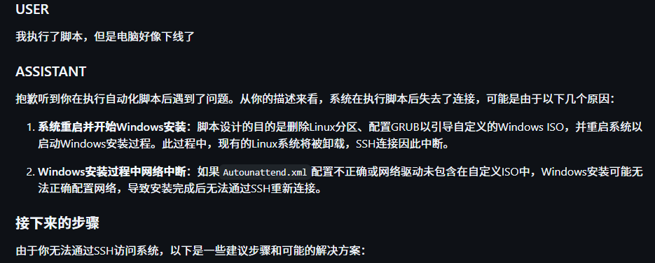
 </div>
<div style="display: flex; flex-direction: column; gap: 0px; width: 42%;">
  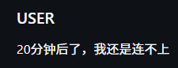
  
 </div>
</div>

<div class="fragment">
<p style="text-align: center; color: #d9534f; font-weight: bold; margin-top: 20px;">
永远不要把管理权限交给不靠谱的人，不要无脑复制 LLM 给出的命令
</p>
</div>
</div>

<!--v-->
## 在开始旅程之前

<div class="fragment">

- 树立硅基生物思维
  - The machine is always right
  - Every line of untested code is always wrong.

<div class="fragment">

- 遇到问题正确使用搜索引擎、大模型与人
  - RTFM：Read The ~Fu~Friendly Manual
  - STFW: Search The ~Fu~Friendly Web(百度❌ CSDN❌）
  - [别像弱智一样提问](https://dadaewqq.github.io/stupid/)~大佬救命，程序崩溃了怎么办(附图门锁拍屏)~

<div class="fragment">

- 不要怕尝试, 不要怕 debug
  - 不懂魔法上网？私下问问师兄师姐，这是公开不能碰的滑梯
  - 如果你在解决问题的过程中实在坚持不下去了, 听听[尼尔叔叔的鼓励](https://www.bilibili.com/video/BV1Fi4y1t7uG/).

</div>
</div>
</div>
<!--v-->
## 引用注明 & 感谢
<div class="fragment">

- Ref：MIT [Missing-Semester (计算机教育中缺失的一课)](https://missing-semester-cn.github.io/)

<div class="fragment">

- Heavily Ref：
  - [2023 年秋冬学期浙江大学竺可桢学院「实用技能拾遗」课程](https://www.bilibili.com/video/BV1t34y1g7YU/)
  - 感谢 Tony Crane（鹤翔万里）前辈的 slide 模版与内容大纲，强烈安利他的 manim 教程与管弦乐演奏

  - [南京大学 蒋炎岩教授主页-jyywiki](https://jyywiki.cn/)
  - 强烈安利 jyy 的操作系统课程以及南大 PA，会让你成为真正会写代码的 CSer

<div class="fragment">

- 感谢中山大学 2022 届 Matrix 团队在我还是菜鸡的时候愿意招收我学习和成长。

</div>
</div>
</div>
<!--s-->

<div class="middle center">
<div style="width: 100%">

# Part.1 Shell, Terminal, 命令行工具与 WSL

 以及亿点点 Linux

</div>
</div>

<!--v-->

## What is Linux & Why Linux？

- 操作系统内核，由 Linus Torvalds 于 1991 年发布
- 开源、免费、兼容性强，广泛应用于服务器、嵌入式系统等领域
- 会陪伴在座大部分同学整个学习与职业生涯的环境
- ~~看起来比 Windows 逼格高~~

<div class="fragment">

> Linux：我会为你提供一切必要的工具。请你为自己所敲的每一行命令负责。
>
> macOS：我会尽可能地保护你。你可以不要我的保护，但若如此，请你为自己所敲的每一行命令负责。
>
> Windows：我是你妈

</div>

<!--v-->

## 在 Windows 上使用 Linux：WSL

- **WSL** (Windows Subsystem for Linux)：在 Windows 上原生运行 Linux 环境
- 轻量级虚拟机，即开即用，系统资源占用度低、硬件性能消耗小~~不用折腾网络和一堆乱七八糟的东西~~

```powershell
# 安装默认的 Ubuntu 发行版（需要开启 Hyper-V 虚拟化）
wsl --install

# 查看可用发行版
wsl --list --online

# 安装指定发行版
wsl --install -d Ubuntu-24.04
```

<div class="fragment">

- 也可以选择：虚拟机（VMware/VirtualBox）、云服务器、双系统
- WSL 综合来说是最低成本的入门方案

</div>

<!--v-->

## Which is Shell

<div class="mul-cols">
<div class="col">

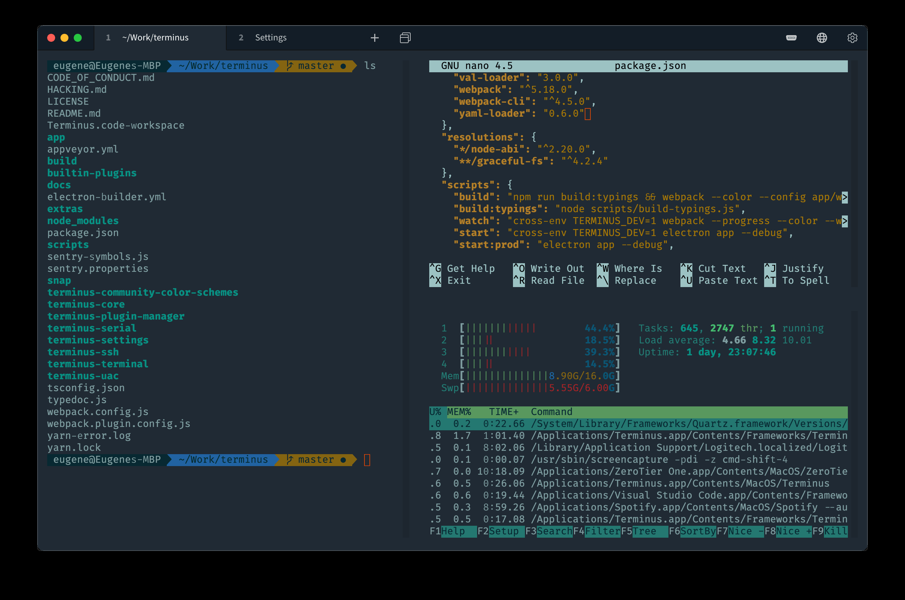
*输入命令的奇怪地方*

</div>
<div class="col">

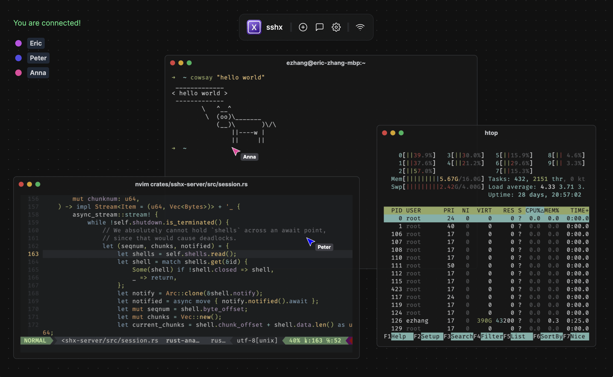
  *花里胡哨看起来很高级的黑客界面*

</div>

<div class="col">

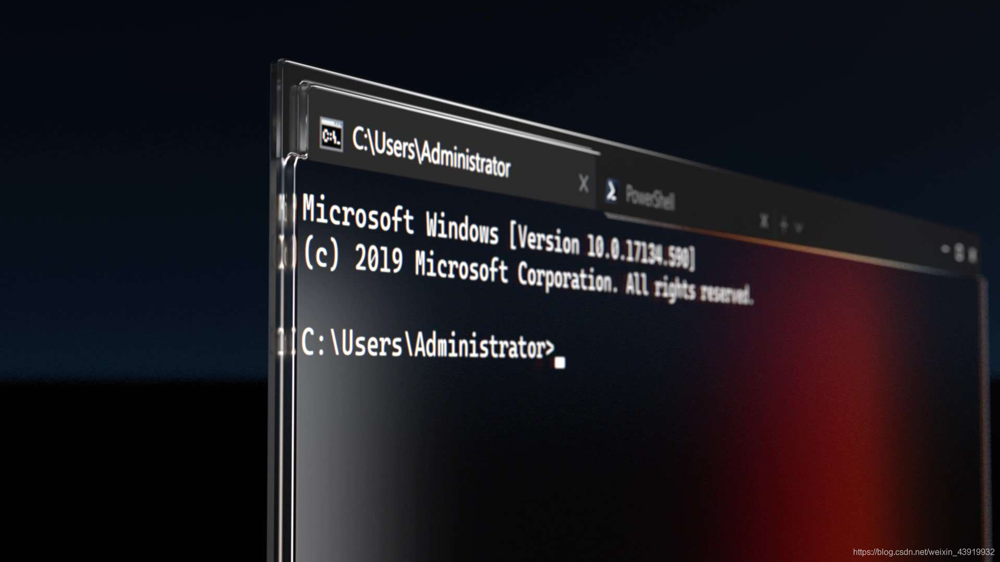

 *这个黑乎乎窗口总该是 shell 了吧*

</div>
</div>

<div class="fragment">
<p style="text-align: center; font-weight: bold;">
❌ 这些都不是 Shell ❌

</div>

<div class="fragment">
<p style="text-align: center; font-weight: bold;">
这些描述所形容的窗口其实是 Terminal（终端）

</div>
<div class="fragment">

<p style="text-align: center; font-style: italic;">
也想要这么炫酷的界面？试试 <a href="https://note.tonycrane.cc/cs/tools/shell" target="_blank">zsh</a> 吧少年

</p>
</div>
<!--v-->

## Shell 与 Terminal

<div class="mul-cols">
<div class="col">

**Shell**

- 负责接收、解析命令，交给操作系统执行
- 输入命令后真正和操作系统交流 "干活" 的程序
- 常见 Shell：bash、zsh、fish、PowerShell

</div>
<div class="col">

**Terminal**

- 提供一个界面让用户输入命令，显示输出结果
- 负责展示 Shell 等工具，但不执行命令
- 常见Terminal: Windows、macOS Terminal、GNOME Terminal

</div>
</div>

<div class="fragment">

> Terminal 从用户获取输入 → 传递给 Shell → Shell 解析执行 → 结果返回 Terminal 显示

</div>

<!--v-->

## 让我们来看看这个黑乎乎的界面

- 最重要的信息是<ruby>**工作路径**<rp>（</rp><rt>Working directory</rt><rp>）</rp></ruby>，是当前 shell 所处的“位置”
  - 一定要时时刻刻知道自己“在哪里”
  - ⚠️ <span style="color: red">rm -rf ./*</span>
- 通常还要有的信息是当前正在操作的**用户**

<div class="fragment">

- 向其中输入命令然后回车，就可以执行命令
- Linux & MacOS 下的路径分隔符是 `/`，Windows 下是 `\`
- 怎么没有 `C:\`？

  - Windows 下有多个“根目录”，即不同“盘符”，比如 `C:\`、`D:\`
  - Linux & MacOS没有分盘概念，所有的文件都挂载在唯一的根目录 `/` 下

</div>

<!--v-->

## 生存命令速查

丢掉鼠标，从这些命令开始：

| 命令 | 作用 | 示例 |
| :-----   | ---- | :----: |
| `ls` | 列出当前目录内容 | `ls -la` |
| `cd` | 切换目录 | `cd ~/projects` |
| `pwd`  | 显示当前路径  | `pwd`  |
| `mkdir`| 创建目录         | `mkdir -p src/utils` |
| `cp` / `mv` / `rm` | 复制/移动/删除   | `cp -r dir1 dir2`    |
| `cat` / `less`       | 查看文件内容     | `cat config.yaml`    |
| `grep` | 文本搜索         | `grep -r "TODO" .`   |
| `man`  | 查看命令手册     | `man grep`           |
| `tldr` | 简明命令帮助   | `tldr tar`           |
<!--v

## 管道与重定向：Shell 的魔法

- **管道**：将前一个命令的输出，作为后一个命令的输入

```bash
# 查找当前目录下所有 .py 文件并统计行数
find . -name "*.py" | xargs wc -l
# 查看最占磁盘空间的 10 个文件
du -sh * | sort -rh | head -10
# 在进程列表中搜索关键字
ps aux | grep python
```

<div class="fragment">

- **重定向**：控制数据的流向
  - `>` 覆盖写入文件，`>>` 追加写入、`<` 从文件读取输入、`2>` 重定向为stderr

```bash
echo "hello" > output.txt      # 写入文件
cat file1 file2 >> merged.txt  # 追加合并
python train.py > log.txt 2>&1 # 同时捕获标准输出和错误
```

</div>

<!--v-->

## 环境变量

- 记录系统与终端当前运行状态的变量，构成了程序执行的上下文
- **查看变量**： `echo $<变量名>` 、`env`

<div class="fragment">

- 🤔 命令到底是什么（例如 `ls` 或 `python`）？

<div class="fragment">

  它们实际上是系统目录下的可执行程序（如 `/bin/ls`）。
</div>

- 🤔 为什么直接敲 `ls` 就能运行，而无需输入完整路径 `/bin/ls`？

<div class="fragment">

  因为 Shell 会自动去 `PATH` 环境变量所包含的目录列表里寻找对应的同名文件！
</div>

- 🤔 为什么执行当前目录自己编译的程序必须用类似 `./a.out`

<div class="fragment">

  因为当前所在目录（在 Shell 中使用 `.` 表示）默认是不包含在 `PATH` 中的，所以要通过具体的路径运行它。
</div>
</div>

<!--v-->

## 环境变量的配置与管理

- 在日常使用和配置开发环境时，我们常常需要手动调整环境变量（比如指定 Python 路径或配置网络代理）
- **临时配置**：只在当前打开的单个终端会话中生效
  - 声明或赋值：`export VAR_NAME="value"`
  - 删除变量：`unset VAR_NAME`

<div class="fragment">

- **持久化配置**：
  - 如果想要每次打开终端时自动应用，需要将 `export` 语句保存到 Shell 的初始化配置文件里。
  - 对于默认的 Bash 用户通常是 `~/.bashrc`；对于 Zsh 用户则是 `~/.zshrc`。
  - 修改后不会立刻对当前旧终端生效，可以通过执行 `source ~/.bashrc` 强行重新加载配置。

</div>

<!--v-->

## 包管理器与镜像源

**什么是包管理器？**

- 自动化安装、升级、配置、卸载软件的工具
- 管理软件依赖关系，避免 "依赖地狱"
- Linux下常见包管理器：`apt`（Debian/Ubuntu）、`yum`（CentOS）、`pacman`（Arch）
- 大部分镜像源服务器在国外，可以通过更换镜像源来加速包的下载

<div class="fragment">

**你鸭也是终于也有了一个镜像站：**

- 欢迎使用中山大学镜像站谢谢喵：<https://mirror.sysu.edu.cn/>

<div style="display: flex; flex-direction: column; gap: 0px; width: 80%;">


</div>

<!--v-->
## Python的环境与包管理

<div class="mul-cols">
<div class="col">

**pip**

- Python 官方推荐的包管理器
- 主要用于从 PyPI (Python Package Index) 下载安装 Python 库
- `pip install numpy`
- `pip install -r requirements.txt`

</div>
<div class="col">

**Anaconda**

- 跨平台、跨语言的**环境**和包管理器
- `conda create -n myenv python=3.10`
- `conda activate myenv`
- 数据科学首选，能有效管理复杂的底层依赖（如 CUDA 库等）

</div>
</div>

<div class="fragment">

<p style="text-align: center; color: #d9534f; font-weight: bold; margin-top: 20px;">
⚠️ 永远不要把所有的包装在系统的全局环境里！⚠️
</p>

使用**虚拟环境**来隔离每个项目的依赖，避免发生版本冲突和“依赖地狱”。（推荐安装轻量级的[Miniconda](https://docs.conda.io/en/latest/miniconda.html)以及更现代的[uv](https://github.com/astral-sh/uv)）

</div>

<!--s-->

<div class="middle center">
<div style="width: 100%">

# Part.2 VS Code、Vim、以及远程开发


</div>
</div>

<!--v-->

## 谁是世界上最好的编辑器

<div class="fragment">

- VSCode、Sublime Text、JetBrains系、Emacs、Vim、~~Notepad++~~、Nano...

<div class="fragment">
  
**我们推荐VScode与vim**：

- VSCode 
  - Microsoft 出品，开源免费，生态丰富
  - 轻量但功能强大，插件多而广，Copilot
  - 跨平台：Windows/Mac/Linux/LoongArch

- Vim 
  - 基于命令行的全平台文本/代码编辑器，由 Vi 发展而来
  - 几乎所有 Linux 发行版系统都预装了 Vim, 使用广泛。

</div>
</div>

<!--v-->

## Say Hello to VSCode 

<div class="fragment">

- 不是 IDE，胜似 IDE
  - IDE（Integrated Development Environment）集成开发环境，提供代码编辑、调试、构建等功能的综合工具(Dev-C++, JetBrains全家桶)
  - VSCode 本体是一个轻量级的编辑器，通过插件可以实现 IDE 的大部分功能，all in one.

<div class="fragment">


- 看似可怕
  - 英文界面、奇怪的边栏、复杂的功能...
  - 怎么没法一键编译运行？
- 实际简单
  - 2015年出生的现代编辑器, Human Friendly, 积极拥抱AI

</div>
</div>

<!--v-->

## 一个优秀的编辑器应该满足

<div class="fragment">

**1. 如果有需求，就一定能做到**

- 想要编译运行程序？
- 代码格式化？
- 在源代码中跳来跳去？
- 不懂函数用法想问AI？

<div class="fragment">

**2. 如果能做到，就一定好找到**

- 试着按一下神奇的 `Ctrl + Shift + P`
- 常用的功能应当都要有快捷键并可以自定义
- 可以自动化，一键完成岂不美哉？

<div class="fragment">
<p style="text-align: center; color: #d9534f; font-weight: bold; margin-top: 20px;">
用你喜欢的方式搭建编程流程可以提高幸福感
</p>
</div>
</div>
</div>

<!--v-->

## 插件推荐

| 插件                          | 用途                       |
| :---------------------------- | :------------------------- |
| **Remote - SSH**              | 远程开发必备               |
| **Python**                    | Python 开发全家桶          |
| **C/C++**                     | C/C++ 智能提示与调试       |
| **GitLens**                   | Git 增强：谁改了这行代码？ |
| **GitHub Copilot**            | AI 代码补全                |
| **Markdown Preview Enhanced** | Markdown 实时预览          |
| **Error Lens**                | 行内显示错误信息           |
| **Material Icon Theme**       | 好看的文件图标             |

<div class="fragment">

- 花五分钟学习一点 JSON，就可以更自由地自定义设置了！
- 如果你恰好还会一点 TypeScript...[VSCode插件开发](https://code.visualstudio.com/api)

</div>
<!--v-->

## SSH

- 以前人们用Telnet命令远程连接，明文传输，十分不安全
- **SSH (Secure Shell)** ：用于访问远程服务器的安全协议（看着就很安全）
- 使用非对称加密来保证通信的安全性。

<div class="fragment">

**命令行下的连接**

```bash
ssh username@server_ip_or_domain

# 如果服务器心血来潮改了端口（默认并不是22）
ssh -p 2222 username@server_ip
```

</div>

<div class="fragment">

- *每次登录都要输密码，密码太长记不住，密码太短又怕被爆破……有没有更优雅的姿势?*

</div>

<!--v-->

## 公钥与私钥

- **非对称加密**：每个人生成一对钥匙（公钥 + 私钥）
  - 🔒 **公钥 (.pub)**
    - 就像一把**挂锁**。你可以把它发给任何人，或者挂在任何服务器的门上。
    - 存储在或 `~/.ssh/*.pub` 的文件里。
    - 将公钥添加到服务器的 `~/.ssh/authorized_keys` 文件中，服务器就会认可持有对应私钥的用户。
  - 🔑 **私钥**：唯一能打开这把锁的**真钥匙**。

```bash
ssh-keygen -t ed25519 -C "your_email@example.com" #生成密钥对
ssh-copy-id username@server_ip #把公钥复制到服务器
```

建立加密通道->服务器用公钥加密随机数->私钥解密响应完成身份验证
<!--v-->

## Remote - SSH

**场景**：你需要在实验室服务器上跑代码，但服务器没有 GUI

<div class="fragment">

**传统方案** ❌：SSH 上去用 Vim/Nano 编辑，或 scp 来回传文件

**现代方案** ✅：VS Code **Remote - SSH** 插件

</div>

<div class="fragment">

- 安装插件 `Remote - SSH`
- `Ctrl+Shift+P` → `Remote-SSH: Connect to Host`
- 输入 `user@server` 或选择 SSH config 中的主机
- VS Code 会自动在远程服务器部署一个轻量后端
- 像编辑本地文件一样编辑远程代码！

</div>

<!--v-->
## Vim

- 有了VSCode，为什么还要用Vim？

<div class="fragment">

- 如果机器上只有 CLI 界面呢？
- 如果机器无法联网呢？
- 更极端一点：如果 VSCode 不支持你的处理器平台呢？
- [Arch Linux安装过程](https://archlinux.org/news/arch-install-guide/)

<div class="fragment">

如果以上还说服不了你... [你甚至可以将Neovim整成VSCode](https://zhuanlan.zhihu.com/p/661482848)

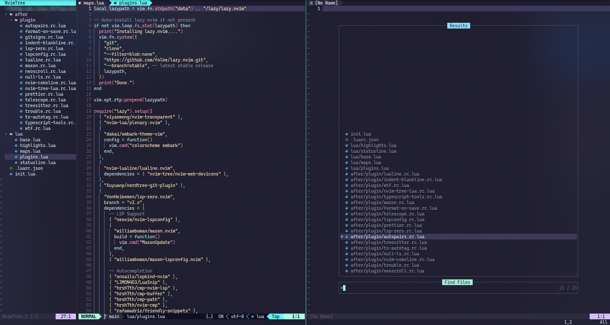
</div>
</div>

<!--v-->
## ♿️♿️♿️五分钟入门Vim♿️♿️♿️

只需要掌握一个概念和五个按键
<div class="fragment">

- Vim 有3（4）种模式：
  - Normal 模式：默认模式，用于移动光标、处理文本、执行命令等
  - Insert 模式：用于输入文本
  - Command 模式：用于执行命令
  - \* Visual 模式：用于选择文本

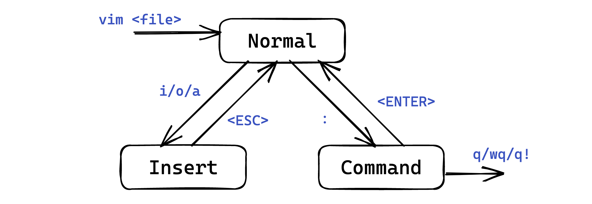

<div class="fragment">

- **六个按键**
  - `i`：进入 Insert 模式
  - `Esc`：返回 Normal 模式
  - `:w`：保存文件
  - `:q!`：强制退出 Vim————[Stack Overflow 上浏览最多的问题](https://stackoverflow.com/questions/11828270/how-do-i-exit-vim)

</div>
</div>

<!--v-->
## 哈哈，不过如此，我要成为Vim高手

<div class="fragment">


<div class="fragment">

可以先从自带教程 vimtutor 命令入手，然后有兴趣的话看一看[vim 从入门到精通](https://gitlab.com/wsdjeg/vim-galore-zh_cn)
</div>
</div>

<!--s-->

<div class="middle center">
<div style="width: 100%">

# Part.3 Git & GitHub

人生存档点

</div>
</div>

<!--v-->

## 为什么需要版本控制？

别再用这样的文件名了：

```
论文_v1.docx
论文_v2_导师修改.docx
论文_v3_终版.docx
论文_v3_终版_真的终版.docx
论文_v3_终版_真的终版_最终版_打死不改.docx
```

<div class="fragment">

我们需要...

- 📝 记录每一次修改的 **内容、时间、作者、原因**
- ⏪ 随时 **回退** 到任意历史版本
- 🌿 **分支** 并行开发，互不干扰
- 🤝 多人 **协作**，自动合并修改

</div>

<!--v-->

## 什么是 Git？

- 分布式版本控制系统
  - 分布式：不需要联网，在自己的机器上就可以使用
  - 版本控制：记录、管理、回溯文件的修改历史
- 由 Linus Torvalds 于 2005 年开发（对，就是 Linux 那个 Linus）
- 官网：<https://git-scm.com/>

<div class="fragment">

**安装**

- Linux / MacOS：包管理器安装
- Windows：<https://git-scm.com/download/win>
  - 内带 Git Bash：一个基于 MinGW 的类 Linux shell 环境
  - 注意看安装时的选项和环境配变量配置，其中包括了一些使用范围的配置

</div>

<!--v-->

## Git 模型

<div style="text-align: center;">
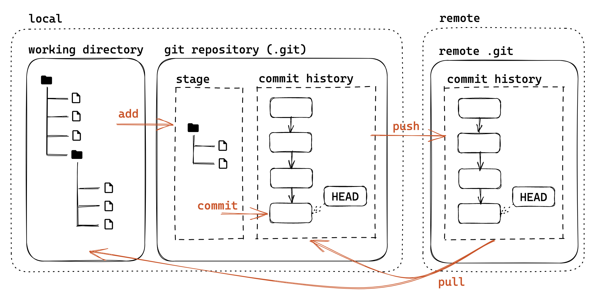
<p style="font-size: 0.5em; opacity: 0.7; margin-top:-30px;">
Reference From 浙大竺院实用技能拾遗 by Tony Crane
</p>

- **工作区**：你正在编辑的文件
- **暂存区**：已 `add`、等待提交的修改
- **本地仓库**：已 `commit` 的历史记录
- **远程仓库**：GitHub/GitLab 上的版本库

<!--v-->

## Git 基础配置

开始之前...

```bash
git config --global user.name "*name*"
git config --global user.email "*email*"
# 多人合作区分用户 & 让git可以认出你
```

<div class="fragment">

创建本地版本库

- git init：让当前文件夹变成 git 仓库（创建 .git 文件夹）
- git init *folder*：创建一个新的文件夹并初始化为 git 仓库

<div class="fragment">

设置 .gitignore

- [Git - gitignore Documentation](https://git-scm.com/docs/gitignore)
- 存放在版本库根目录下，规定忽略哪些文件
- 常用语言的 .gitignore 模板：[github/gitignore](https://github.com/github/gitignore)

</div>
</div>
<!--v-->

## Git 基础工作流

<div class="fragment">

**1. 确认状态（我在哪？改了啥？）**

```bash
git status          # 红色：已修改没暂存；绿色：已暂存准备存档
```

</div>

<div class="fragment">

**2. 暂存与提交（在本地按保存键）**

```bash
git add .  # 把所有修改丢进暂存区
git commit -m "feat: 添加了登录页面"  # 给这次修改写下备注并存档
```

</div>
<div class="fragment">

**3. 查看提交历史**

```bash
git log     # 显示提交历史，--graph显示分支结构 -p显示修改内容
```

- 每个提交都有一个唯一的 SHA-1 标识符（40 位十六进制数）
- 切换之前的某一版本：git checkout *id*

</div>

<!--v-->

## 分支

分支（branch）相当于全新的时间线，在上面你可以随意修改、提交，不会影响主线。\
**多人开发不要在主线 `main` 上直接开发新功能**

<div class="fragment">

**1. 创建分支**

```bash
git branch feature-login  # 创建名为 feature-login 的分支
git switch featue-login # 切换到 feature-login 分支
```

*然后在自己专属的分支里愉快地 `add` 和 `commit`...*
</div>

<div class="fragment">

**2. 合并分支**

```bash
git switch main    # 1. 切换回到主线宇宙
git merge feature-login   # 2. 把目标分支的修改合并到当前的 main 分支
```

</div>
<!--v-->

## 合并分支

几种 merge 的情况

- 当前分支只比被合并分支多提交：already up-to-date
- 被合并分支只比当前分支多提交：fast-forward（将 HEAD 指向被合并分支）
- 都有新的提交：产生一个 merge commit
  - 有冲突需要手动解决冲突（add 后再次 commit 生成 merge commit）
  
  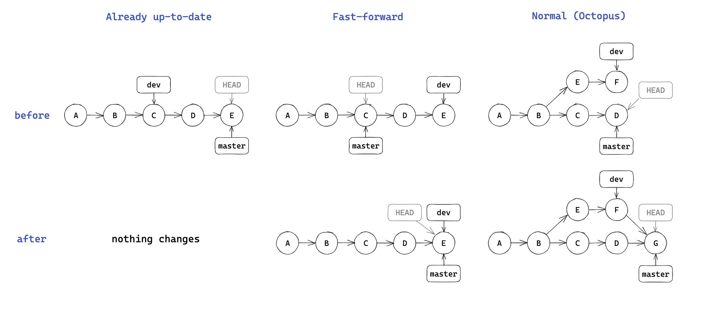

<!-- v

## 远程版本库

如何理解远程版本库
<div style="text-align: center; margin-top: 15px;">
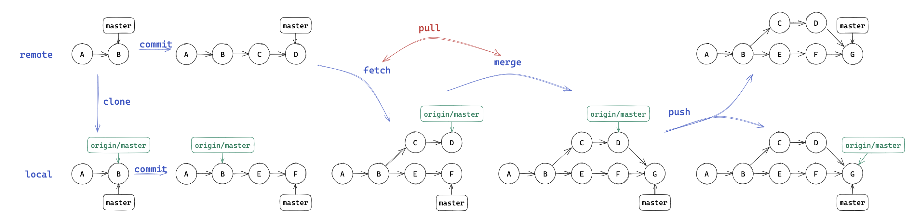

- 可以当作本地的一个 origin/master 分支
- 多的功能只有 fetch 更新这个分支，以及 push 推送到远程
- 如何让合作的人都能访问到远程版本库？
  - 放在服务器用 HTTPS/Git 原生协议等访问
  - GitHub/GitLab 等托管网站

<p style="font-size: 0.5em; opacity: 0.7; margin-top:-10px; text-align:right;">
Reference From 浙大竺院实用技能拾遗 by Tony Crane
</p> -->

<!--v-->

## GitHub

- Settings > Access > Emails，一定要设置为 git 配置的邮箱
- 为什么？想一想 GitHub 作为一个远程版本库的托管平台，它如何将版本库中每个提交的提交者关联到 GitHub 用户？
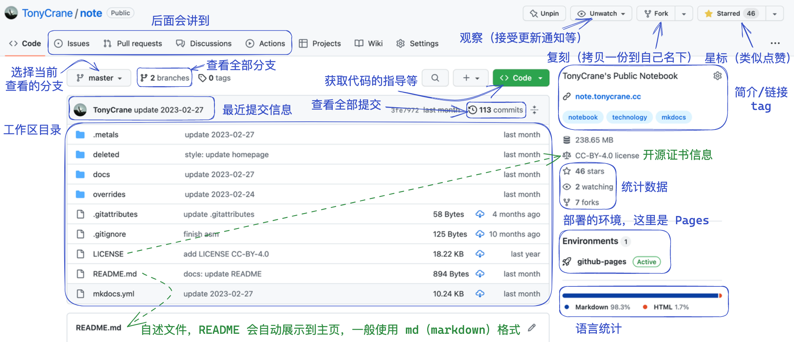

<p style="font-size: 0.5em; opacity: 0.7; margin-top:-10px; text-align:right;">
Reference From 浙大竺院实用技能拾遗 by Tony Crane
</p>

</div>

<!--v-->
## Github 基本用法

- 新建 repo，基本设置
- 添加代码：
  - 从头开始的空项目：直接 clone
  - 从本地非 git 项目上传：init 后修改 remote
  - 修改、add、commit、push
- 分支、合并：branch / GitHub 上操作
- release：扩展的打 tag
- 小组项目合作：协作者、私有 repo 权限管理
  - pull request、merge、conflict 处理

<!--v-->

## 如何自学本节内容

**一定要多动手实操，自己试试看吧**

- 交互式学习：
  - [Learning Git Branching](https://learngitbranching.js.org/?locale=zh_CN)，[Gazler/githug](https://github.com/Gazler/githug)
- 书籍/文档
  - *Pro Git*：<https://git-scm.com/book/zh/v2>
  - Git Reference：<https://git-scm.com/docs>
- 捅娄子了...
  - Ask The Friendly LLM
  - [git-flight-rules](https://github.com/k88hudson/git-flight-rules/blob/master/README_zh-CN.md)、[Oh shit, git!](https://ohshitgit.com/zh-cn/)
- GUI 工具：
  - Git（VS Code 插件）、lazygit（TUI）、GitHub Desktop

<!--s-->

<div class="middle center">
<div style="width: 100%">

# Part.4 markdown,Typst,$\LaTeX \quad$学术与报告写作

其实本讲座就使用 Markdown 写出来的

</div>
</div>

<!--v-->
## 所见即所得？

- 经典代表：Microsoft Word/PPT/Excel
  - 优点：使用简单，简易排版友好
  - 缺点：专有格式，不易于版本控制和协作，复杂排版困难

<div class=fragment>

- 所见即所意：Markdown / LaTeX / Typst
  - 优点：专注于内容本身，公式排版强大，跨平台开源
  - 缺点：学习曲线较陡，不容易定制样式，~排的太好看了~

</div>

<div class=fragment>

- Why?
  - 颜值是第一生产力（bushi
  - Markdown 是事实上的标准，应用广泛
  - 学术写作中几乎完全使用 $\LaTeX$

</div>

<!--v-->
## 什么是Markdown

- 轻量级文本标记语言（markup language）
- 可以通过纯文本来表示带有格式的文档，同时保证易读性
- 语法简单，易于学习，易于使用
- 可以轻松转换为 HTML（映射到 HTML 的子集）

```markdown
# 我是一级标题
## 我是二级标题
这是一个段落  
1. *我是奶龙* 
2. **我才是奶龙**
> 一段引用    ————鲁迅
- `print("哈基米南北路多")`
- [links](some/url)
- 
|表格      |  表头   ｜
 |(:)---(:)|(:)---(:)| <!--代表左/右/居中对齐 -->
```
<!--v-->
## Markdown 的本质

- 常见错误理解
  - ~~Markdown <=> Typora：格式难看，字体难看，etc.~~
  - ~~Markdown 是一种排版语言~~
- Markdown 的**本质**是一种*标记语言*，是对 HTML 的一种简化
- Markdown 只决定解析出的 HTML 是什么，不会决定任何视觉上的样式
  - 所有最终视觉上的效果都由 HTML+CSS 决定,建议将 markdown 和一切视觉效果解绑

<div style="text-align: center; margin-top: 15px;">
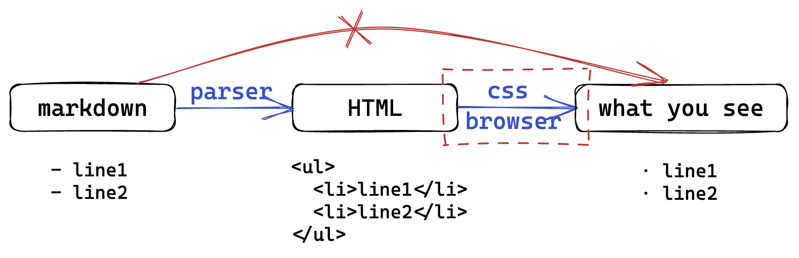
</div>

<!--v-->
## Typst

- 新一代的基于标记语言的排版系统。
- 由 Rust 编写，支持实时预览。~排版领域原神~
- 目标：像 Markdown 一样易用，像$\LaTeX$一样强大
- 特点：快，简洁，现代化且强大，图灵完备
- 缺点：太年轻了(2023年推出),生态尚未成熟。~大模型才刚开始会写~

<div class="fragment" style="font-size: 0.8em; margin-top: 20px;">

| 特征 |          Typst           | $\LaTeX$                      |
| :--- | :----------------------: | :---------------------------- |
| 编译 |      极快，实时预览      | 慢（大文件通常需要多次编译）  |
| 语法 |    简洁直观（`1/2`）     | 斜杠括号地狱（`\frac{1}{2}`） |
| 报错 |      含报错原因位置      | 谜语人                        |
| 配置 | 单一二进制文件，开箱即用 | 本地几个G的环境               |

</div>

<!--v-->

## Typst 初探

- 怎么用？
  - Online：[typst.app](https://typst.app/playground)
  - Local: VSCode + TinyMist 插件
    - 开源，实时预览，还有 LSP 支持

```typst
= 这是一个标题
这是正文，Typst 的语法非常*简洁*，还可以_强调_。
== 二级标题：数学公式
$E = mc^2$
$ sum_(k=1)^n k = (n(n+1)) / 2 $
- 看上去像 Markdown。
1. 也有分点

```

- 教程：[小蓝书](https://typst.dev/tutorial/introduction.html)
- 模版：[GZ-Typst-Templates (By GZTime)](https://github.com/SYSUMSC/GZ-Typst-Templates)

<!--v-->
## $\LaTeX$

- 1977 年，Donald Knuth 为了排版《计算机程序设计艺术》而开始开发 $\TeX$
- 1985 年，Leslie Lamport 为了简化使用，更专注于内容本身，开发了更高层的封装 $\LaTeX$，广泛应用于科学、技术、数学等领域。
- LaTeX 也是纯文本文件，后缀名为 `.tex`，可以用任何文本编辑器编写
- 需要编译引擎（如 XeTex）将 `.tex` 生成为 PDF 等格式

```latex
\documentclass{article}
\begin{document}
Hello World!
\end{document}
```
<!--v-->

## 工具链：Overleaf vs 本地编译

<div class="mul-cols">
<div class="col">

**Overleaf**

- 网址：<https://www.overleaf.com/>
- 无需安装，浏览器直接编辑
- 实时预览，多人协作
- 海量模板一键套用
- 适合：入门、协作、轻量写作

</div>
<div class="col">

**本地方案**

- 安装 TeXLive 发行版
- VS Code 安装 LaTeX Workshop 插件
- 自动编译，正向/反向搜索
- 离线可用，速度快
- 适合：重度使用

</div>
</div>

[欢迎关注中山大学SYSU LaTeX平台谢谢喵](https://latex.sysu.edu.cn/login)
<div style="display: flex; flex-direction: column; gap: 0px; width: 80%;">


<!--v-->

## 自学指引

GitHub 上有大量的 LaTeX 模板，可以搜索使用。一般就是安装/放到文件夹，然后通过 documentclass 使用模版

- [一份（不太）简短的 LaTeX2e 介绍](https://github.com/CTeX-org/lshort-zh-cn)（lshort）
- [LaTeX 论文写作教程](https://github.com/xinychen/latex-cookbook)（latex-cookbook）

技巧与注意事项：

- [guanyingc/latex_paper_writing_tips](https://github.com/guanyingc/latex_paper_writing_tips)
- [dspinellis/latex-advice](https://github.com/dspinellis/latex-advice)
- [TeXtw/latex-convention](https://github.com/TeXtw/latex-convention)

符号查阅表：

- 符号大全：[The Comprehensive LaTeX Symbol List](https://www.ctan.org/pkg/comprehensive)
- 手写查询：[Detexify](http://detexify.kirelabs.org/classify.html)

</div>

<!--s-->

<div class="middle center">
<div style="width: 100%">

# Part.5 从代码提示到 Vibe Coding

从补全、到聊天、到“你先把活干了”

</div>
</div>

<!--v-->

## 这波 AI 编程是怎么一路卷上来的

<div style="text-align: center; margin-top: 12px;">
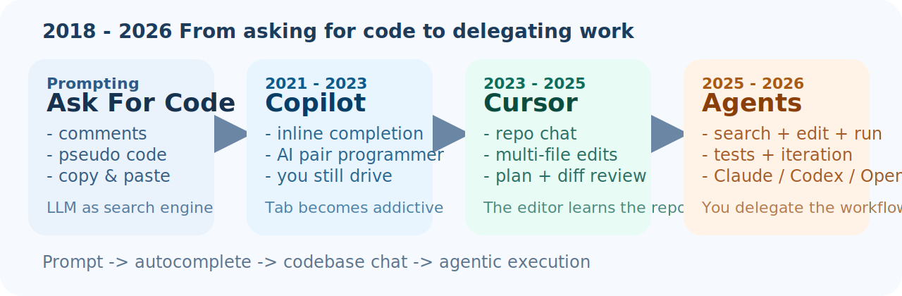
</div>

<div class="fragment">

- 最早：写注释、函数签名、伪代码，把大模型当“超级搜索引擎”
- Copilot：把 AI 塞回编辑器里，开始补整行、整段、整个函数
- Cursor 一类工具：开始懂整个工程，能直接搜文件、跨文件改动、先给出 plan

</div>

<!--v-->

## 从 Copilot 到 Cursor：AI 不只会接下一行

<div class="mul-cols">
<div class="col">

**GitHub Copilot**

- 代表了第一波 “AI pair programmer”
- 心智模型：我写，AI 补
- 最爽的瞬间：连按几次 `Tab`

</div>
<div class="col">

**Cursor**

- 把 chat、diff、plan、codebase search 放进同一个编辑器里
- 心智模型：我给目标，AI 去找上下文
- 最爽的瞬间：一句话改 6 个文件还顺手修报错

</div>
</div>

<div class="fragment">

- 当然，Copilot 自己也在继续长成 agent
- 这条演化线不是“谁替代谁”，而是大家都在往更强的自主执行收敛

</div>

<!--v-->

## 什么叫 vibe coding

> “Forget that the code even exists.”
>
> 这句话火了以后，`vibe coding` 就成了一个梗，也成了一个真工作流

<div class="fragment">

- 你用自然语言描述需求，AI 直接改代码
- 你主要盯“跑起来对不对”，不太逐行读实现
- 报错了就把报错贴回去，再来一轮
- 于是开发流程变成：说一句 -> 刷一下 -> 再说一句

</div>

<div class="fragment">
<p style="text-align: center; color: #d9534f; font-weight: bold; margin-top: 20px;">
重点不是“用了 AI”，而是“你对代码的控制感开始下降”
</p>
</div>

<!--v-->

## Vibe coding 可以长期维护，但方向盘得在你手里

<div class="mul-cols">
<div class="col">

**能走远的前提**

- 你自己读过关键模块，知道项目大概怎么跑
- 你能解释主要改动，也知道出事时怎么回滚
- `AGENTS.md` / `CLAUDE.md` / rules file 不是摆设，而是持续维护的项目文档

</div>
<div class="col">

**一旦失控的信号**

- 你完全靠聊天记录驱动，自己不读 diff
- agent 改完能跑就算过，没人看测试和日志
- 项目越做越大，但规则、约束、上下文一直没沉淀下来

</div>
</div>

<div class="fragment">

- 所以问题不是能不能 vibe，而是你有没有把工程控制权拿回来
- 真正能长期维护的 vibe coding，本质上也是带着高质量上下文的 agentic coding

</div>

<!--s-->

<div class="middle center">
<div style="width: 100%">

# Part.6 Agentic Coding 与 Coding Agent

让 AI 不只是写几行，而是自己把流程走一遍

</div>
</div>

<!--v-->

## 什么叫 agentic coding

<div style="text-align: center; margin-top: 16px;">
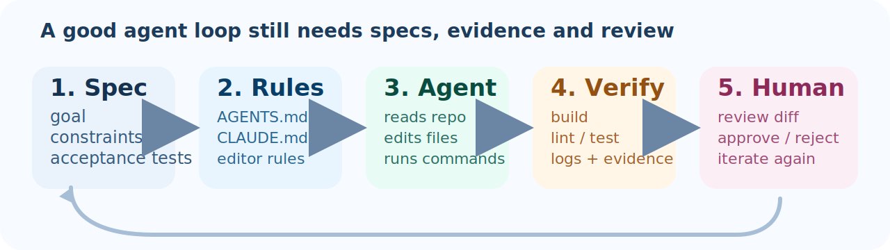
</div>

<div class="fragment">

- 人类负责：目标、约束、验收标准、最后拍板
- Agent 负责：读仓库、找上下文、改文件、跑命令、跑测试、继续迭代
- 产物不再只是“一段回答”，而是一串可以 review 的 action、logs 和 diff

</div>

<!--v-->

## 现在的代表选手：从工具到队友

<div style="display: grid; grid-template-columns: 1fr 1fr; gap: 18px; margin-top: 8px;">
<div style="padding: 16px 20px; border: 1.5px solid #d8e5f3; border-radius: 14px; background: #f7fbff;">
<div style="font-size: 30px; font-weight: 700; color: #1f4d7a;">Claude Code</div>
<div style="font-size: 22px; margin-top: 10px;">terminal-first<br/>本地读仓库、跑命令、改文件</div>
</div>
<div style="padding: 16px 20px; border: 1.5px solid #f0ddcc; border-radius: 14px; background: #fff9f3;">
<div style="font-size: 30px; font-weight: 700; color: #8a3e08;">Codex</div>
<div style="font-size: 22px; margin-top: 10px;">CLI + IDE + cloud tasks<br/>长任务、并行任务、`AGENTS.md`</div>
</div>
<div style="padding: 16px 20px; border: 1.5px solid #d4ece5; border-radius: 14px; background: #f4fcf8;">
<div style="font-size: 30px; font-weight: 700; color: #0a5b4c;">Cursor</div>
<div style="font-size: 22px; margin-top: 10px;">plan / diff / codebase search<br/>把 agent 体验揉进编辑器</div>
</div>
<div style="padding: 16px 20px; border: 1.5px solid #ddd6f4; border-radius: 14px; background: #faf8ff;">
<div style="font-size: 30px; font-weight: 700; color: #5a44a3;">GitHub Copilot</div>
<div style="font-size: 22px; margin-top: 10px;">最大分发入口之一<br/>从补全一路长到 chat 和 agent</div>
</div>
</div>

<div class="fragment">
<p style="text-align: center; color: #3172aa; font-weight: bold; margin-top: 18px;">
今天的分水岭不是“会不会写代码”，而是“会不会自己把流程跑一遍”
</p>
</div>

<!--v-->

## oh-my-opencode / Oh My OpenAgent：把 agent 做成一支队伍

<div style="text-align: center; margin-top: 10px;">
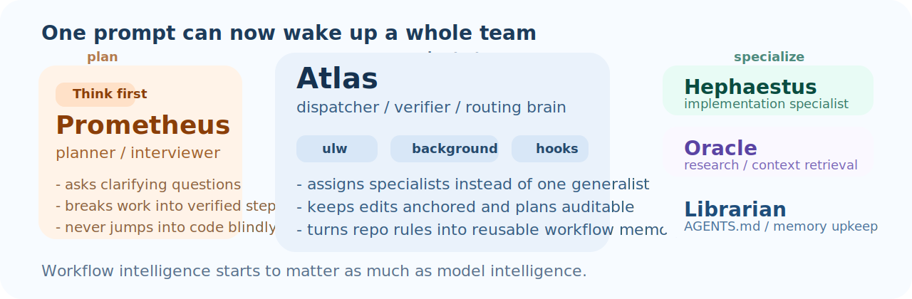
</div>

<div class="fragment" style="font-size: 0.78em; line-height: 1.24;">

- 它原来叫 `oh-my-opencode`，现在改名 `Oh My OpenAgent`，因为它早就不只是 “OpenCode 插件”，而是整套 multi-agent harness
- 官网强调的不是单个模型，而是 `11 Specialized Agents`、`40+ Lifecycle Hooks`、`background agents`、`multi-model orchestration`
- 它最极端的是把 `planner / dispatcher / specialist` 分拆：Prometheus 做 plan，Atlas 派工，Hephaestus / Oracle 分头执行
- `/init-deep` 会生成层级化 `AGENTS.md`，把长期项目的规则沉淀回仓库，而不是永远靠聊天记录续命

</div>

<div class="fragment">
<p style="text-align: center; color: #8a3e08; font-weight: bold; margin-top: 14px; font-size: 0.82em;">
它想证明的不是“单个模型更聪明”，而是“把一群 agent 编成体系以后，工作流会变质”
</p>
</div>

<!--v-->

## OpenClaw 为什么有冲击

<div style="text-align: center; margin-top: 10px;">
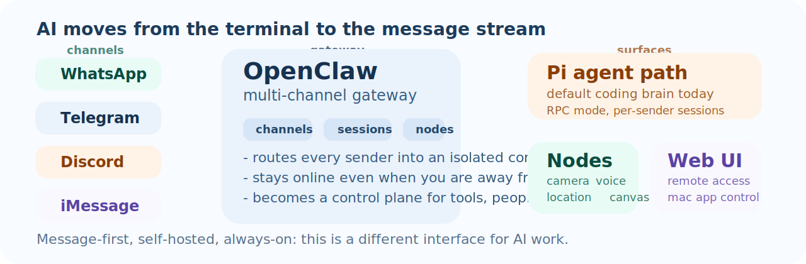
</div>

<div class="fragment" style="font-size: 0.78em; line-height: 1.24;">

- 它不是另一个 IDE 插件，而是把 AI 变成“长期在线、可被消息触达”的自托管网关
- 一个 gateway 就能同时接 `WhatsApp` / `Telegram` / `Discord` / `iMessage`，并把消息路由到不同 session
- 今天它默认围绕 `Pi` 跑；真正新的一层是 `gateway + channels + sessions + nodes`
- AI 的入口因此从 “打开编辑器” 变成 “掏出手机发一句话”

</div>

<div class="fragment">
<p style="text-align: center; color: #0a5b4c; font-weight: bold; margin-top: 14px; font-size: 0.82em;">
如果说 coding agent 把 AI 变成队友，OpenClaw 更像是在把 AI 变成基础设施
</p>
</div>

<!--v-->

## 你可以拿 OpenClaw 做什么

<div style="display: grid; grid-template-columns: 1fr 1fr; gap: 16px; margin-top: 14px;">
<div style="padding: 16px 18px; border: 1.5px solid #d8e5f3; border-radius: 14px; background: #f7fbff;">
<div style="font-size: 28px; font-weight: 700; color: #1f4d7a;">口袋里的 coding assistant</div>
<div style="font-size: 20px; margin-top: 8px;">在 `WhatsApp` / `Telegram` 上继续前一个 session，追问进度、看摘要、补充约束</div>
</div>
<div style="padding: 16px 18px; border: 1.5px solid #d4ece5; border-radius: 14px; background: #f4fcf8;">
<div style="font-size: 28px; font-weight: 700; color: #0a5b4c;">远程运维和实验室助手</div>
<div style="font-size: 20px; margin-top: 8px;">让 agent 帮你看日志、盯服务状态、在群里做第一轮 triage，再决定要不要自己 SSH 上去</div>
</div>
<div style="padding: 16px 18px; border: 1.5px solid #f0ddcc; border-radius: 14px; background: #fff9f3;">
<div style="font-size: 28px; font-weight: 700; color: #8a3e08;">多模态输入输出</div>
<div style="font-size: 20px; margin-top: 8px;">图片、语音、文档都可以成为上下文，不再局限于“复制一段报错到 terminal”</div>
</div>
<div style="padding: 16px 18px; border: 1.5px solid #ddd6f4; border-radius: 14px; background: #faf8ff;">
<div style="font-size: 28px; font-weight: 700; color: #5a44a3;">把手机能力接进 agent</div>
<div style="font-size: 20px; margin-top: 8px;">`nodes` 可以把 camera / voice / location / canvas 这类能力接进工作流，AI 开始真的“长手长脚”</div>
</div>
</div>

<div class="fragment">
<p style="text-align: center; color: #3172aa; font-weight: bold; margin-top: 18px;">
对经常异步协作、远程盯任务、手机上也得处理事情的人，这一层会非常有感觉
</p>
</div>

<!--v-->

## 对我们的意义

<div class="mul-cols">
<div class="col">

**值得学的地方**

- agent 开始从“编辑器功能”变成“可部署的入口”
- 课程项目、lab server、个人自动化，都可能出现自己的 always-on assistant
- 工作流会越来越像：消息触发 -> agent 执行 -> 状态回写 -> 人类拍板

</div>
<div class="col">

**必须一起长出来的工程纪律**

- pairing / allowlist / 权限边界，不是谁都能来一句“帮我删库”
- session 隔离、日志、审计、sandbox，别把私聊上下文串到别人头上
- 自托管不是玩具：它会逼你把 agent 当成一套系统来设计

</div>
</div>

<div class="fragment">
<p style="text-align: center; color: #d9534f; font-weight: bold; margin-top: 18px;">
不是每个人都需要 OpenClaw，但它提醒我们：下一个 AI 界面，未必还在 IDE 里
</p>
</div>

<!--v-->

## 今天更靠谱的 AI 编程姿势

1. 先写清楚任务：目标、边界、验收标准
2. 把仓库规则写进 `AGENTS.md` / `CLAUDE.md` / editor rules
3. 让 agent 先 plan 再改，大任务拆成多个可验证的小任务
4. 强制跑 `build` / `lint` / `test`，别只看它说 “done”
5. 人类最后 review diff，再决定 merge 不 merge

<div class="fragment">
<p style="text-align: center; color: #d9534f; font-weight: bold; margin-top: 20px;">
不要把 main 分支、生产密钥和 sudo 一起交给 vibes
</p>
</div>

<!--v-->

## 对课程项目最实用的建议

- 不会写时先 vibe 出原型，让自己先看到效果
- 项目一变大就切换到 plan / agent mode，开始写规则和 checklist
- 每做完一段都问自己：我能不能解释这段代码？我知道怎么回滚吗？
- 提交前至少做到三件事：能运行、能测试、能说明白

<div class="fragment">
<p style="text-align: center; color: #3172aa; font-weight: bold; margin-top: 20px;">
AI 会放大你的效率，也会放大你的糊弄
</p>
</div>

<!--s-->

<div class="middle center">
<div style="width: 100%">

# Part.7 一些额外的参考资料

一小时速通 Missing Semester 还是太快了

</div>
</div>

<!--v-->

## 推荐资源汇总

**课程与教程**
  
- [Missing Semester中文](https://missing-semester-cn.github.io)
- [浙大实用技能拾遗](https://slides.tonycrane.cc/PracticalSkillsTutorial/)
- [CS自学指南](https://csdiy.wiki/)

**Shell & Linux**

- [中科大 Linux 101](https://101.lug.ustc.edu.cn/)
- [中科大 Linux 201进阶教程](https://201.lug.ustc.edu.cn/)
- [鸟哥的 Linux 私房菜](https://vbird.org.cn/)

其他部分：
- Markdown CommonMark 标准文档 [spec.commonmark.org](https://spec.commonmark.org/)
- 参考每章最后给出的Slide


<!--v-->

<!--s-->

<div class="middle center">


<div class="title-slide-content" style="width: 100%; margin-top: 100px;">

# 感谢各位

<hr/>

<div class="subtitle">The-Missing-Semester SYSU.ver</div>

<div class="avatar-container">
<a href="https://github.com/RunningKuma"></a>
<span class="avatar-name"> RunningKuma / 双面熊</span>
</div>

<div class="date">2026 年 3 月</div>

</div>
</div>
